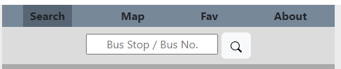

## Welcome to GitHub Pages

You can use the [editor on GitHub](https://github.com/bobbestben/123/edit/gh-pages/index.md) to maintain and preview the content for your website in Markdown files.

Whenever you commit to this repository, GitHub Pages will run [Jekyll](https://jekyllrb.com/) to rebuild the pages in your site, from the content in your Markdown files.

### Markdown

Markdown is a lightweight and easy-to-use syntax for styling your writing. It includes conventions for

```markdown
Syntax highlighted code block

# Header 1
## Header 2
### Header 3

- Bulleted
- List

1. Numbered
2. List

**Bold** and _Italic_ and `Code` text

[Link](url) and 
```

For more details see [Basic writing and formatting syntax](https://docs.github.com/en/github/writing-on-github/getting-started-with-writing-and-formatting-on-github/basic-writing-and-formatting-syntax).

### Jekyll Themes

Your Pages site will use the layout and styles from the Jekyll theme you have selected in your [repository settings](https://github.com/bobbestben/123/settings/pages). The name of this theme is saved in the Jekyll `_config.yml` configuration file.

### Support or Contact

Having trouble with Pages? Check out our [documentation](https://docs.github.com/categories/github-pages-basics/) or [contact support](https://support.github.com/contact) and we’ll help you sort it out.


Use AJAX to make a request to an external data source like OMDBapi and insert some of the data retrieved into the DOM
Implement responsive design (i.e. it should be fully functional on desktop, tablet, mobile, etc)
Have one or more complex user interface modules such as a carousel, drag and drop, a sticky nav, tooltips, etc

Your application or game must meet these requirements:
Built with HTML, CSS and JavaScript (jQuery is strongly optional)
Use Javascript for DOM manipulation
Hosted on Github pages
Commits to Github frequently
A README.md file with explanations of the technologies used, the approach taken, a link to your live site, installation instructions, unsolved problems, etc.


Search and filter functionality (e.g. flight or hotel booking websites)


Be approximately 5 minutes in length
Show off all features of the app
Explain the technical details
Explain the technical challenges
Explain which improvements you might make

# BMWsg - Bus Arrival Timing App

This is my attempt at making your life better if you own a BMW (Bus, MRT, Walk) in Singapore.

This app fetches the bus arrival timings of all the buses at a bus stop.

Search a bus stop to try it out!

## Features of the app

### Interactive Nav bar



Pages *within* a page, hover and *current page selection* effects

Main idea is assigning a unique **class** to the currently selected page. 

Here I'm using data attribute to assign which content sections(data-tab-content) belong to which page (data-tab-target).

```markdown
### HTML
<div class="active" data-tab-target=".home-page">Search</div>
<div data-tab-target=".map-page">Map</div>

<section class="home-page active" data-tab-content>
<section class="map-page p-2 text-center" data-tab-content>

### CSS
[data-tab-content] { 
    display: none; 
}

.active[data-tab-content] {
    display: block;
}

### JavaScript
tab.onclick = function() { ...

    target.classList.add('active')
    tab.classList.add('active')

... }
```

### Search Functionality with Error Handling

Currently can only search for bus stop number.

CORS Proxy is required if not will encounter CORS errors. Currently using *cors-anywhere* proxy but need to request access [here](https://cors-anywhere.herokuapp.com/corsdemo) each time you start the app.

Searching for bus number not yet as requires modification of the data structure and algorithm.

```markdown
### Updating query parameter based on search input
let busArrivalUrl = "https://cors-anywhere.herokuapp.com/
                        http://datamall2.mytransport.sg/
                            ltaodataservice/BusArrivalv2?BusStopCode="

busArrivalUrl += input.value

##Fetching data from API - Proxy Used, AuthKey in Headers
fetch(busArrivalUrl, {
    method: 'GET',
    headers: {
       'AccountKey': 'c5SCu1KNQ4OsnpfU+wxoyg=='
    }
})
    .then(response => {
        return response.json()
    })

```

### Bus Stop Info Section 

Update bus timings and bus stop information using the API data.

Everything is formatted mainly using Bootstrap flexbox and grid system. Icons also from bootstrap.

```markdown
### Sample *div* that will be appended from JS after searching bus stop
<div class="row flex-nowrap bus-arrival-section">
    <div class="col-6">Bus No. 1</div>
    <div class="col">|3min|</div>
    <div class="col">|15min|</div>
    <div class="col">|20min|</div>
</div>

### Nested Loop in JS
//First Loop - for each bus at bus stop
///Second Loop - for each arrival timing for each bus

### Time and Date in JS
const busArrivalTiming = "2022-06-30T12:11:16+08:00"

const currentTime = new Date() // "Fri Jul 01 2022 04:59:34 GMT+0800 (Singapore Standard Time)"

const futureTime = new Date(busArrivalTiming)

const minsToArrival = Math.floor((futureTime - currentTime) / (1000*60))
```

### Refresh Button
Same as my search function, just that i need to store the previous search value

### Tooltip

### Not really sticky Nav, but Scrollable Div

### Future Improvements
Bus Stop timings - i wanna make it live, like the otter in TraceTogether

I wanna put MRT map here, can zoom in/out

On Search page, i wanna allocate 50% of height to put a real-time map.
My location, Bus stop locations 

Fav tab - explore local cache/storing/saving


